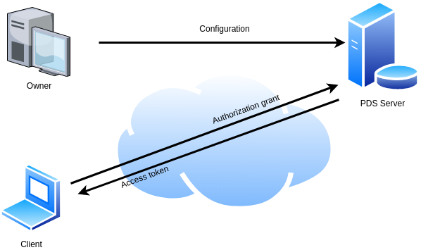

# Data Sovereignty Module
- [Description](#Description)
    - [Architecture Overview](#Architecture-Overview)
    - [Relation with SOFIE](#Relation-with-SOFIE)
    - [Key Technologies](#Key-Technologies)
- [Usage](#Usage)
    - [Prerequisites](#Prerequisites)
    - [Installation](#Installation)
    - [Configuration](#Configuration)
    - [Execution](#Execution)
    - [Docker Images](#Docker-Images)
- [Testing](#Testing)
    - [Prerequisites for Testing](#Prerequisites-for-Testing)
    - [Running the Tests](#Running-the-Tests)
    - [Evaluating Results](#Evaluating-the-Results)
- [Open Issues](#Open-Issues)
- [Release Notes](#Release-Notes)
- [Contact Info](#Contact-Info)
- [License](#License)

## Description
This is the documentation for the Data Sovereignty module of SOFIE's PDS component. It implements an OAuth2.0 authorization server. It accepts as
authorization grants: Decentralized Identifiers, Verifiable Credentials, and pre-shared secret keys. It outputs JSON web tokens. 

### Architecture Overview

The architecture of the data sovereignty module is illustrated in Figure 1. It is composed of a resource owner, that defines
access control policies, the PDS authorization server, that generates access tokens to legitimate client, and Clients that 
provide authorization grants to receive access tokens.


Figure 1: The  Data Sovereignty module of the PDS component.

### Relation with SOFIE
The Data Sovereignty module is part of SOFIE's [PDS](https://github.com/SOFIE-project/Privacy-and-Data-Sovereignty) component.
PDS is used by SOFIE's [Energy data exchange](https://media.voog.com/0000/0042/0957/files/sofie-onepager-energy-exchange_final.pdf) and [Food supply chain](https://media.voog.com/0000/0042/0957/files/sofie-onepager-food_final.pdf) pilots in order to implement access control over the shared energy data. 

More information about this component and its relation to the SOFIE project can be found in [D2.5 Federation Framework, SOFIE deliverable](https://media.voog.com/0000/0042/0957/files/SOFIE_D2.5-Federation_Framework%2C_2nd_version.pdf)

## Usage

### Prerequisites
Python 3, Hyperledger Indy SDK and the python wrapper, PyJWT are required. Use the following commands to install the prerequisites in Ubuntu 18.04 

```bash
sudo apt-key adv --keyserver keyserver.ubuntu.com --recv-keys CE7709D068DB5E88
sudo add-apt-repository "deb https://repo.sovrin.org/sdk/deb bionic stable"
sudo apt-get update
sudo apt-get install -y libindy
pip3 install python3-indy pyjwt web3
pip3 install Werkzeug
pip3 install pynacl
```

### Installation

### Configuration
A sample configuration file is provided at conf/psd.conf


### Execution
From the root directory run `python3 PDS/pds.py`

The executed script creates an Authorization Server (AS) that listens for REST API calls at port 9001. A client requests
a token, and the AS responds with an authentication challenge, the client responds to challenge, and the AS sends the token.
All API calls are made using the HTTP POST method and all parameters are included in the POST request payload. 

Currently clients can be authenticated using either a DID, or an `authentication grant'. In the former case
the PDS should be configured with token metadata per authorized DID (using the administrative interface).
The latter case is based in a pre-configured, shared secret. Clients authenticated using the grant have a 
privileged role and can define themselves the token metadata. 

### Token request API call (unauthenticated users)
| Parameter | Possible values |
| --- | --- |
| grant-type | "DID" |

Response
```
{'code':401, 'message' : 'Proof required','challenge': A challenge}
```

Example
```Python
payload = {'grant-type':'DID'}
response  = requests.post("http://localhost:9001/gettoken", data = payload).text
response =json.loads(response)
challenge = response['challenge']
```
### Token request API call (authenticated users)
| Parameter | Possible values |
| --- | --- |
| grant-type | "DID", "auth_code" |
| grant | The DID, or the authentication code of the client |
| challenge (only with grant_type = "DID")| The challenge generated in the previous API call |
| proof (only with grant_type = "DID") | The response to the challenge |
| log-token (optional, records the token in an Ethereum smart contract) | The hex encoded metadata to be recorded, along with the token |
| erc-721 (optional, creates an erc-721 token) | True |
| enc-key (optional)| A hex encoded Ed25519 public key to encrypt the token |
| metadata (optional, only with grant_type = "auth_code")| JSON encoded token metadata | 


Response
```
{'code':200, 'message' : The generated token}
```

Example
```Python
nbf   = time.mktime(datetime.datetime(2020, 4, 1, 00, 00).timetuple())
exp   = time.mktime(datetime.datetime(2020, 4, 1, 23, 59).timetuple())
grant = "shared secret"
key   = "E390CF3B5B93E921C45ED978737D89F61B8CAFF9DE76BFA5F63DA20386BCCA3B"
payload = {'grant-type':'auth_code', 'grant':grant, 'log-token':'0xa5b9d60f32436310afebcfda832817a68921beb782fabf7915cc0460b443116a', 'enc-key':key, 'metadata':json.dumps({'aud': 'sofie-iot.eu','nbf':nbf, 'exp': exp}}
response  = requests.post("http://localhost:9001/gettoken", data = payload).text
response =json.loads(response)
token = response['message']
```

### Docker Images
In order to build PDS image, execute the script `docker-build.sh`. Then you can run PDS using, for example,  `docker run -tid --rm -p 9001-9002:9001-9002 pds`. You can verify that PDS is running properly be executing in the examples folder: `python3 get_token.py`


## Testing

### Prerequisites for Testing
For testing purposes ganache-cli and Indy testing pool are required. To install ganache execute:

```bash
npm install -g ganache-cli
```

To install Indy testing pool, execute from the component's root folder:

```bash
docker build -f tests/conf/indy-pool.dockerfile -t indy_pool . 
```

Tests are executed using pytest and pytest-asyncio. To install it execute 

```bash
pip3 install -U pytest 
pip3 install pytest-asyncio
```

### Running the tests
First you need to run Hyperledger Indy testing pool:

```bash
docker run --name test_pool -itd --rm -p 9701-9708:9701-9708 indy_pool
```

Then you need to setup Indy testing accounts, and finally run the test. From the root directory run:

```bash
python3 tests/indy_setup.py 
python3 -m pytest -s  tests/
```

### Evaluating the Results

Test results are shown in the standard output. 


## Known/Open Issues

No known issues

## Contact info

Please contact Nikos Fotiou or Iakovos Pittaras (AUEB) in case of any questions.

## License

This component is licensed under the Apache License 2.0.

***