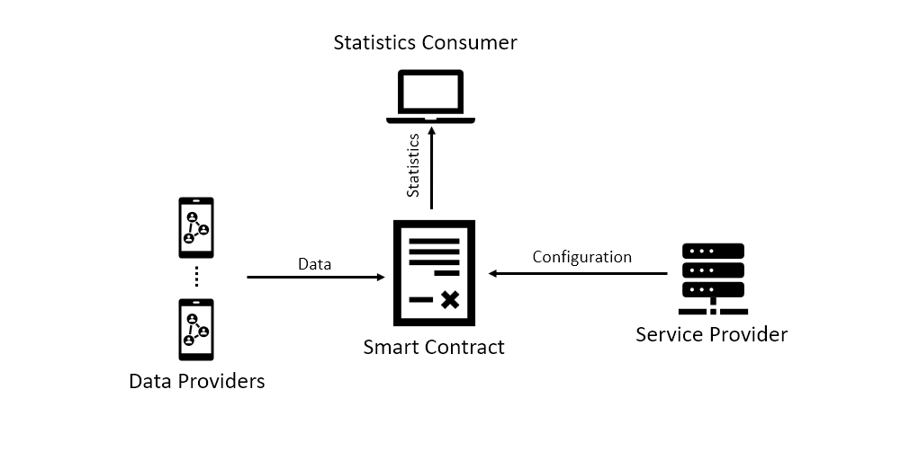

# Privacy Module

## Table of Contents
- [Description](#Description)
    - [Architechture Overview](#Architecture-Overview)
    - [Relation with SOFIE](#Relation-with-SOFIE)
    - [Key Technologies](#Key-Technologies)
- [Usage](#Usage)
    - [Prerequisites](#Prerequisites)
    - [Installation](#Installation)
    - [Configuration](#Configuration)
    - [Execution](#Execution)
- [Testing](#Testing)
    - [Prerequisites for Testing](#Prerequisites-for-Testing)
    - [Running the Tests](#Running-the-Tests)
    - [Evaluating Results](#Evaluating-the-Results)
- [Open Issues](#Open-Issues)
- [Contact Info](#Contact-Info)
- [License](#License)

## Description
This is the documentation for the Privacy module of SOFIE's [PDS](https://github.com/SOFIE-project/Privacy-and-Data-Sovereignty) component. 

This module enables the creation of *privacy preserving surveys*. These are surveys
that allow users to add *noise* to their responses, using local differential privacy mechanisms.
The addition of the noise prevents 3rd parties from learning meaningful information about specific users, but at
the same time aggregated statistics can be extracted. The accuracy of the extracted statistics depends on the
number of responses.

User results are stored in a smart contract, included in the module. Therefore, since all answers are public
anybody can extract the aggregated statistics. 

### Architecture Overview

The architecture of the privacy module is illustrated in Figure 1. It is composed of a Service Provider that creates
surveys, a Data Provider that provides responses to the survey, and a Statistics Consumer that extracts statistics
using the provided responses. All responses are stored in an Ethereum smart contract. 


Figure 1: The privacy module of the PDS component.

### Relation with SOFIE
The privacy module is part of SOFIE's [PDS](https://github.com/SOFIE-project/Privacy-and-Data-Sovereignty) component.
PDS is used by SOFIE's [Energy data exchange](https://media.voog.com/0000/0042/0957/files/sofie-onepager-energy-exchange_final.pdf) and [Food supply chain](https://media.voog.com/0000/0042/0957/files/sofie-onepager-food_final.pdf) pilots. 

More information about this component and its relation to the SOFIE project can be found in [D2.5 Federation Framework, SOFIE deliverable](https://media.voog.com/0000/0042/0957/files/SOFIE_D2.5-Federation_Framework%2C_2nd_version.pdf)

### Key technologies
The software modules are implemented in Python 3. Survey responses are stored in an Ethereum smart contract. In order to provide local differential the *basic one-time RAPPOR* algorithm is used. This algorithm is described in 

> U. Erlingsson, V. Pihur, and A. Korolova, “RAPPOR: Randomized
Aggregatable Privacy-Preserving Ordinal Response,” in Proc. of ACM
SIGSAC Conference on Computer and Communications Security, 2014

## Usage

### Prerequisites
Python 3 and the web3 library are required. Web3 can be installed Ubuntu 18.04 using

```bash
pip3 install web3
```

### Installation

Compile and deploy the `contract\survey.sol` smart contract. 

###  Configuration

Edit the configuration file `conf/privacy.conf` and provide the following information.

| Parameter | Meaning |
| --- | --- |
|web3provider | The URL of the Web3 provider|
|survey_sc_address | The address of the deployed survey contract|


### Execution

Before using this module a *survey* must be created. Each survey is composed of a single question that has multiple possible answers (multiple choice question). 

A survey can be used using the `Service_Provider` class included in the `service_provider.py` file.
This class implements a method called  `create_survey` that accepts the following inputs:

| Parameter | Meaning |
| --- | --- |
| number_of_choices | (int) The number of possible choices to the question|
| survey_name | (string) the name of the survey |

A user can privately respond to a survey by using the `Provider` class included in the `data_provider.py` file. This class implements
a method called `record_response`. This method accepts the following inputs:

| Parameter | Meaning |
| --- | --- |
| number_of_choices | (int) The number of possible choices to the question|
| correct_choice | (int  in the range of [0, number_of_choices)) the correct choice |
| survey_name | (string) the name of the survey |

This method generates a privacy preserving response and stores it in the smart contract. 

If a significant number of responses has been collected(~1000) then statistics with quite good precision can be collected. The class `Consumer`
implemented in the `statistics_consumer.py` file, provides a method (`estimate_responses`) that generates the probability of each choice, based on the information 
recorded in the smart contact.  This method accepts the following inputs:

| Parameter | Meaning |
| --- | --- |
| number_of_choices | (int) The number of possible choices to the question|
| survey_name | (string) the name of the survey | 

It returns an array of size `number_of_choices` and each element of the array is the probability of the corresponding choice.

## Testing

### Prerequisites for Testing
For testing purposes ganache-cli is required. To install ganache execute:

```bash
npm install -g ganache-cli
```

Tests are executed using pytest and pytest-asyncio. To install it execute 

```bash
pip3 install -U pytest 
pip3 install pytest-asyncio
```

### Running the Tests

Execute the following command

```bash
python3 -m pytest -s tests/privacy/test_privacy.py 
```

### Evaluating the Results

Test results are shown in the standard output. 

## Known/Open Issues

No known issues

## Contact info

Please use github issues page  in case of any questions.

## License

This component is licensed under the Apache License 2.0.

***